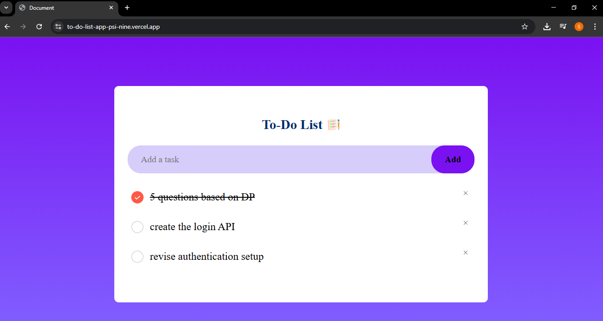

# To-Do List App

A simple and beautiful To-Do List web application built with HTML, CSS, and JavaScript.

## Features
- Add new tasks
- Mark tasks as completed (with a check icon)
- Remove tasks
- Tasks are saved in your browser's local storage
- Responsive and modern UI

## Live Demo
You can try the app online here:

[View on Vercel](https://to-do-list-app-psi-nine.vercel.app/)

## Getting Started

### Prerequisites
- A modern web browser (Chrome, Firefox, Edge, etc.)

### Running the App
1. Download or clone this repository to your local machine.
2. Open `index.html` in your web browser.

## Project Structure
```
index.html         # Main HTML file
style.css          # Stylesheet for the app
script.js          # JavaScript logic
images/            # Icons for checked/unchecked tasks and app icon
```

## Customization
- You can change the background, colors, or icons by editing `style.css` and the images in the `images/` folder.

## Screenshots


## License
This project is open source and free to use.
